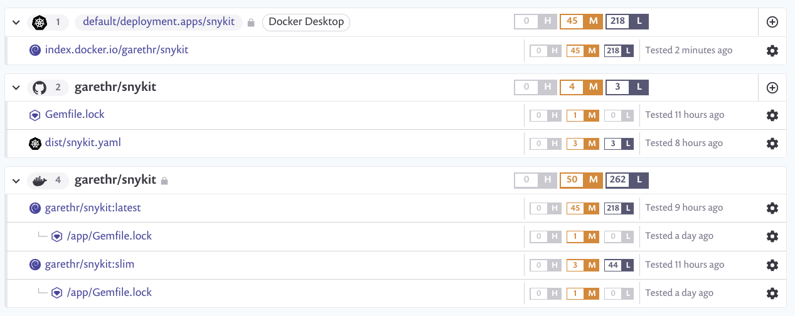

# Snykit

A simple vulnerable Ruby application deployed to Kubernetes, used for demonstration purposes.

  

This repository demonstrates using the [k14s](https://k14s.io/) toolchain for Kubernetes. Specifically using [YTT](https://get-ytt.io/) for templating the configuration, [kbld](https://get-kbld.io/) to build the image and store the SHA in the Kubernetes manifest and [kapp](https://get-kapp.io/) to deploy to Kubernetes.

GitHub Actions is used to automatically build the images and generate a Kubernetes configuration file populated with the image SHA. You can deploy the latest version of the application using `kubectl` like so:

```console
kubectl apply -f https://raw.githubusercontent.com/garethr/snykit/master/dist/snykit.yaml
```

Alternatively you can use `kapp` here as well:

```console
kapp deploy -a snykit -f https://raw.githubusercontent.com/garethr/snykit/master/dist/snykit.yaml
```

## Vulnerable?

The application, and the associated image, have a few known vulnerabilities. We can use [Snyk](https://snyk.io/) to detect them. Snyk can be used via the CLI, or integrated with your CI system (including with [Actions](https://github.com/garethr/snykit/actions)) but in this case we've imported directly from GitHub, Docker Hub and the running application in Kubernetes.


